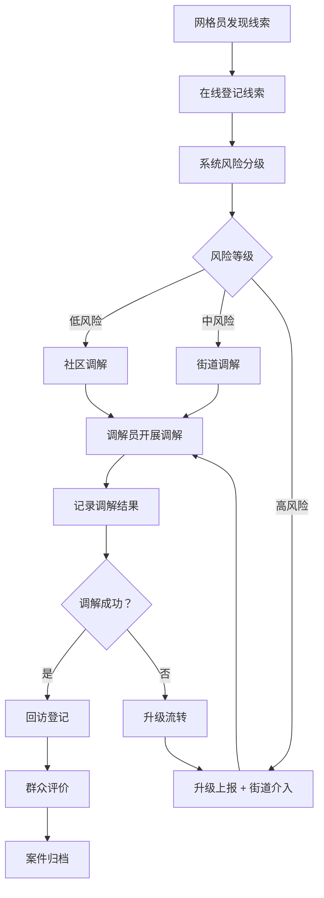

## 1. 产品概述

社区矛盾纠纷风险排查 Web 应用是面向街道综治中心、社区网格员和调解员的基层治理信息化平台，实现矛盾纠纷从发现、登记、流转、调解到回访的全闭环管理。

- **核心目标**：提升基层矛盾纠纷化解效率，实现风险早发现、早干预、早化解
- **目标用户**：街道综治中心管理人员、社区网格员、人民调解员
- **核心价值**：打通矛盾纠纷全流程数据链，支持科学决策和精准治理

## 2. 核心功能

### 2.1 用户角色

| 角色 | 登录方式 | 核心权限 |
|------|----------|----------|
| 街道综治中心 | 账号密码登录 | 全局数据查看、任务派单、升级上报、统计分析、系统管理 |
| 社区网格员 | 账号密码登录 | 线索登记、入户走访、风险排查、调解申请、消息接收 |
| 调解员 | 账号密码登录 | 调解记录、回访登记、群众评价、案件进度更新 |

### 2.2 功能模块

1. **风险总览**：数据大屏、风险地图、案件概览、预警提醒
2. **线索登记**：线索录入、分类管理、重复合并、风险分级、地图定位
3. **入户走访**：走访计划、走访记录、照片附件、问题反馈
4. **调解流转**：案件分配、调解记录、责任人派单、限时提醒、升级上报
5. **重点人员**：人员档案、风险标签、跟踪记录、黑名单预警
6. **统计分析**：趋势对比、分类统计、区域分析、日报导出
7. **消息中心**：系统通知、任务提醒、超时预警、消息已读未读

### 2.3 页面详情

| 页面名称 | 模块名称 | 功能描述 |
|----------|----------|----------|
| 风险总览 | 数据概览卡片 | 展示待处理案件、今日新增、调解成功率、重点人员数量等关键指标 |
| 风险总览 | 风险地图 | 基于地图展示各区域纠纷分布，支持点击查看详情 |
| 风险总览 | 趋势图表 | 展示近30天案件数量趋势、纠纷类型占比 |
| 风险总览 | 预警列表 | 展示高风险案件、超期未处理案件 |
| 线索登记 | 线索列表 | 展示所有线索，支持筛选、搜索、分页 |
| 线索登记 | 新增线索 | 表单录入线索信息，包括类型、地点、涉及人员、风险等级 |
| 线索登记 | 线索详情 | 查看线索完整信息，支持编辑、删除、合并重复线索 |
| 线索登记 | 地图定位 | 选择纠纷发生地点，支持地图打点 |
| 入户走访 | 走访计划 | 制定走访计划，分配网格员，设置走访时间 |
| 入户走访 | 走访记录 | 记录走访情况，上传现场照片，记录问题反馈 |
| 入户走访 | 任务列表 | 展示待走访、已完成、已超期的走访任务 |
| 调解流转 | 案件列表 | 展示所有调解案件，按状态分类 |
| 调解流转 | 案件详情 | 查看案件全流程信息，包括线索来源、走访记录、调解过程 |
| 调解流转 | 调解记录 | 录入调解过程、参与人员、调解结果 |
| 调解流转 | 派单管理 | 分配调解员，设置办理时限 |
| 重点人员 | 人员列表 | 展示重点人员档案，支持标签筛选 |
| 重点人员 | 人员详情 | 查看人员基本信息、涉案记录、风险评估 |
| 统计分析 | 多维度统计 | 按时间、类型、区域、责任人等维度统计 |
| 统计分析 | 趋势对比 | 同比、环比数据分析，图表展示 |
| 统计分析 | 报表导出 | 支持日报、周报、月报导出为 Excel |
| 消息中心 | 消息列表 | 展示所有系统消息，分类展示 |
| 消息中心 | 消息详情 | 查看消息内容，支持标记已读、全部已读 |

## 3. 核心流程

### 3.1 矛盾纠纷闭环处理流程

网格员发现矛盾线索 → 在线登记线索 → 系统自动风险分级 → 综治中心审核派单 → 调解员接收任务 → 开展调解工作 → 记录调解结果 → 回访登记 → 群众评价 → 案件归档

### 3.2 流程图

## 4. 用户界面设计

### 4.1 设计风格

- **主色调**：政务蓝 (#165DFF)，体现专业、稳重、可信赖
- **辅助色**：
  - 成功绿 (#00B42A)：用于已完成、已解决
  - 警告橙 (#FF7D00)：用于待处理、超期预警
  - 危险红 (#F53F3F)：用于高风险、紧急案件
  - 信息灰 (#86909C)：用于辅助信息
- **布局风格**：顶部导航 + 侧边栏菜单 + 内容区的经典政务布局
- **卡片设计**：圆角 8px，轻微阴影，层次分明
- **字体**：使用 Noto Sans SC，确保中文显示清晰美观
- **图标风格**：线性图标，简洁明了，统一 24px 尺寸

### 4.2 页面设计概览

| 页面名称 | 模块名称 | UI 元素 |
|----------|----------|---------|
| 风险总览 | 数据概览 | 彩色渐变卡片，大数字展示，图标点缀，hover 微动画 |
| 风险总览 | 风险地图 | 地图背景，热力点标记，弹窗详情 |
| 风险总览 | 图表区 | ECharts 折线图、饼图、柱状图，配色协调 |
| 线索登记 | 列表页 | 数据表格，行悬停高亮，操作列按钮组 |
| 线索登记 | 表单页 | 分步表单，标签页切换，表单验证提示 |
| 调解流转 | 案件详情 | 时间轴展示流程，附件预览区域 |
| 统计分析 | 图表页 | 多图表联动，筛选器置顶，导出按钮醒目 |
| 消息中心 | 消息列表 | 未读红点标识，分类标签切换 |

### 4.3 响应式设计

- **桌面优先**：以 1920px 宽度为基准设计
- **平板适配**：1024px 宽度下调整侧边栏宽度，优化表格展示
- **移动适配**：768px 宽度下边栏收起为汉堡菜单，表格改为卡片式展示

### 4.4 交互动效

- 页面加载：元素渐入 + 轻微上移动画
- 按钮 hover：背景色过渡 + 轻微放大
- 数据加载：骨架屏占位
- 表单验证：即时校验，错误提示滑入
- 消息通知：右上角 Toast 滑入
