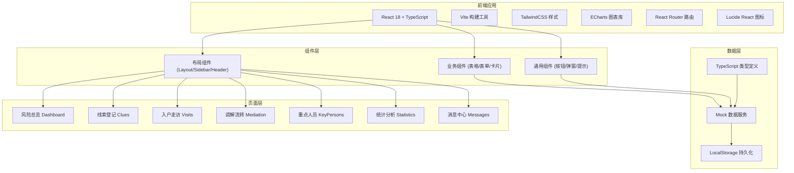

## 1. 架构设计



## 2. 技术选型说明

- **前端框架**: React@18 + TypeScript — 组件化开发，类型安全
- **构建工具**: Vite@5 — 快速开发，热更新
- **样式方案**: TailwindCSS@3 — 原子化 CSS，快速构建 UI
- **图表库**: ECharts@5 — 丰富的图表类型，支持大数据量
- **路由**: React Router@6 — 单页应用路由管理
- **图标库**: Lucide React — 轻量、美观的线性图标
- **状态管理**: React Context + useState — 轻量状态管理，避免过度工程化
- **数据方案**: Mock 数据 + LocalStorage — 前端独立运行，无需后端服务

## 3. 路由定义

| 路由路径 | 页面名称 | 说明 |
|----------|----------|------|
| `/` | 风险总览 | 首页 Dashboard，数据概览 |
| `/dashboard` | 风险总览 | 同上，别名 |
| `/clues` | 线索登记 | 线索列表与管理 |
| `/clues/new` | 新增线索 | 线索录入表单 |
| `/clues/:id` | 线索详情 | 查看单条线索详情 |
| `/visits` | 入户走访 | 走访任务列表 |
| `/visits/plan` | 走访计划 | 制定走访计划 |
| `/visits/:id` | 走访详情 | 查看走访记录 |
| `/mediation` | 调解流转 | 调解案件列表 |
| `/mediation/:id` | 案件详情 | 查看案件全流程 |
| `/key-persons` | 重点人员 | 重点人员档案管理 |
| `/statistics` | 统计分析 | 多维度数据统计与导出 |
| `/messages` | 消息中心 | 系统消息与通知 |

## 4. 数据模型定义

### 4.1 线索 (Clue)

```typescript
interface Clue {
  id: string;
  title: string;
  type: 'neighbor' | 'property' | 'family' | 'labor' | 'other';
  typeName: string;
  description: string;
  location: string;
  latitude?: number;
  longitude?: number;
  involvedPersons: string[];
  reporter: string;
  reporterPhone?: string;
  riskLevel: 'low' | 'medium' | 'high' | 'critical';
  status: 'pending' | 'processing' | 'mediating' | 'resolved' | 'closed';
  statusName: string;
  createTime: string;
  updateTime: string;
  assignee?: string;
  deadline?: string;
  attachments: string[];
  mergedFrom?: string[];
  isDuplicate: boolean;
}
```

### 4.2 走访记录 (Visit)

```typescript
interface Visit {
  id: string;
  clueId?: string;
  planDate: string;
  actualDate?: string;
  visitor: string;
  visitedPerson: string;
  visitedAddress: string;
  purpose: string;
  content: string;
  photos: string[];
  issues: string;
  status: 'pending' | 'completed' | 'overdue';
  statusName: string;
  createTime: string;
}
```

### 4.3 调解案件 (Mediation)

```typescript
interface Mediation {
  id: string;
  clueId: string;
  title: string;
  parties: Party[];
  mediator: string;
  mediatorPhone?: string;
  startTime: string;
  endTime?: string;
  records: MediationRecord[];
  result: 'pending' | 'success' | 'failed' | 'escalated';
  resultName: string;
  agreement?: string;
  followUp?: FollowUp;
  status: 'assigned' | 'mediating' | 'completed' | 'closed';
  statusName: string;
  createTime: string;
}

interface Party {
  name: string;
  phone: string;
  role: 'plaintiff' | 'defendant' | 'witness';
}

interface MediationRecord {
  id: string;
  time: string;
  content: string;
  participants: string[];
  attachments: string[];
}

interface FollowUp {
  time: string;
  visitor: string;
  content: string;
  satisfaction: 1 | 2 | 3 | 4 | 5;
  comment: string;
}
```

### 4.4 重点人员 (KeyPerson)

```typescript
interface KeyPerson {
  id: string;
  name: string;
  gender: 'male' | 'female';
  age: number;
  idCard?: string;
  phone?: string;
  address: string;
  tags: string[];
  riskLevel: 'low' | 'medium' | 'high';
  caseCount: number;
  lastContactTime?: string;
  remark?: string;
  isBlacklisted: boolean;
  createTime: string;
  records: PersonRecord[];
}

interface PersonRecord {
  id: string;
  time: string;
  type: 'visit' | 'mediation' | 'warning';
  content: string;
  operator: string;
}
```

### 4.5 消息 (Message)

```typescript
interface Message {
  id: string;
  type: 'system' | 'task' | 'warning' | 'reminder';
  typeName: string;
  title: string;
  content: string;
  relatedId?: string;
  relatedType?: string;
  sender: string;
  receiver: string;
  isRead: boolean;
  createTime: string;
  priority: 'low' | 'medium' | 'high';
}
```

### 4.6 统计数据 (Statistics)

```typescript
interface DailyStats {
  date: string;
  clueCount: number;
  mediationCount: number;
  resolvedCount: number;
  visitCount: number;
}

interface TypeStats {
  type: string;
  typeName: string;
  count: number;
  percentage: number;
}

interface AreaStats {
  area: string;
  count: number;
  resolvedCount: number;
  rate: number;
}
```

## 5. 目录结构

```
src/
├── components/          # 通用组件
│   ├── layout/         # 布局组件
│   │   ├── Layout.tsx
│   │   ├── Sidebar.tsx
│   │   └── Header.tsx
│   ├── common/         # 基础组件
│   │   ├── Button.tsx
│   │   ├── Card.tsx
│   │   ├── Modal.tsx
│   │   ├── Table.tsx
│   │   └── Toast.tsx
│   └── business/       # 业务组件
│       ├── RiskCard.tsx
│       ├── ClueList.tsx
│       ├── StatusTag.tsx
│       └── Timeline.tsx
├── pages/              # 页面组件
│   ├── Dashboard/
│   ├── Clues/
│   ├── Visits/
│   ├── Mediation/
│   ├── KeyPersons/
│   ├── Statistics/
│   └── Messages/
├── types/              # TypeScript 类型定义
│   └── index.ts
├── data/               # Mock 数据
│   ├── clues.ts
│   ├── visits.ts
│   ├── mediation.ts
│   ├── keyPersons.ts
│   ├── messages.ts
│   └── statistics.ts
├── hooks/              # 自定义 Hooks
│   ├── useToast.ts
│   └── useLocalStorage.ts
├── utils/              # 工具函数
│   ├── format.ts
│   └── constants.ts
├── App.tsx
├── main.tsx
└── index.css
```

## 6. 核心功能实现方案

### 6.1 风险分级机制
- 基于线索类型、涉及人数、历史记录自动计算风险等级
- 支持人工调整风险等级
- 高风险案件自动推送预警消息

### 6.2 地图定位
- 使用 SVG 模拟地图区域划分
- 支持按区域筛选案件
- 热点图展示纠纷密度

### 6.3 流程时间轴
- 案件全流程时间轴展示
- 每个节点记录操作人、时间、内容
- 支持附件预览

### 6.4 数据导出
- 前端实现 Excel 导出功能
- 支持自定义导出字段和时间范围
- 导出格式符合政务报表规范

### 6.5 权限控制
- 基于角色的页面访问控制
- 按钮级权限控制
- 不同角色看到不同的数据范围
